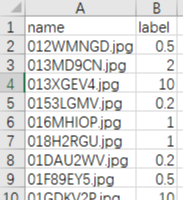

# project3--RMB-value-identify

The aim of this project : **Identify the face value of RMB**    I got the score: 99.98

like the image:

I wrote the entire implementation process on my GitHub.https://github.com/xr0927/project3--RMB-value-identify

------

## my environment：

keras + tensorflow-gpu==1.10

Quadruple TITAN Xp Server

------

## step1. make datasets

- **original datasets：**train folder + label.csv + test folder

1. under the *train* folder：

2. under the *label.csv*:

3. under the *test* folder : 20,000 pictures

- **My dataset format:**

  

*Description* : I divided the *original training datasets* by RMB value and stored them in the corresponding folder.

(you know, under the *train* folder, the name of folders are the RMB values)------------------------>And then divide them into *train_split* of 80% and *val_split* of 20%--------------------------->And then I put the original test_data directly under the *test_RMB* folder.

**Let's do it !!!!!!!!!!!**

1. Processing *train_face_value_label.csv* files : Divided by label and stored in the corresponding  **.txt file*.

​       These operations are all done in excel(Converting formats, sorting, extracting, etc. in excel,all of these operations     are so easy)

2. run *divide_cls.py* : According to the picture name in the *.txt file, and find the corresponding picture under the train folder, then move them to the corresponding label folder.

   

3. run *split_train_val.py* :divide train datasets into *train_split* of 80% and *val_split* of 20%

   ------

## step2. Training

run *train.py*

I find that *val_acc did not improve from 0.99922*, so I kill it

------

## step3. testing

1. run *test_averageCSV.py* : Generate *.csv* file

   
   
   

you must be know what it means I guess, I don't have to explain it anymore.

2. run *last_max_valueCSV.py* :Extract the maximum value of each row in the above table in order to generate the final commit .csv file

